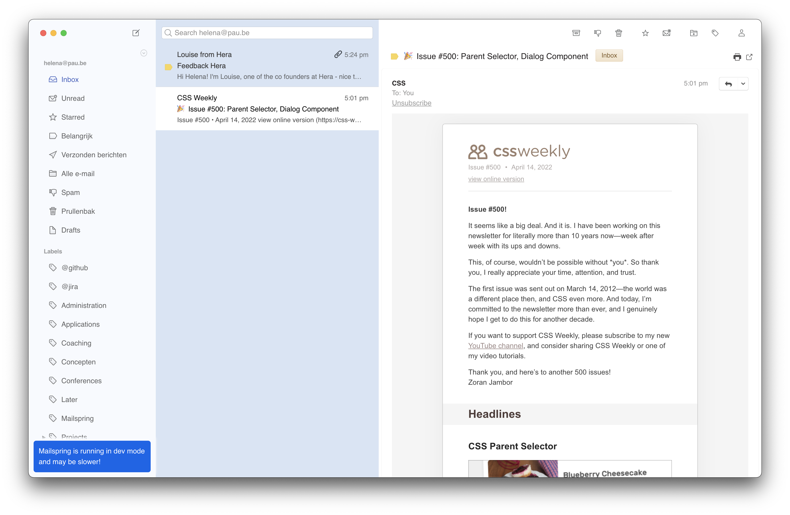

# Mailspring Minimalist

## Installation

If you're interested in trying this theme, go ahead and:

1. download a ZIP file for the latest on the [Releases](https://github.com/hstandaert/mailspring-minimalist/releases) page.
2. Extract the contents somewhere
3. Open Mailspring and navigate to **Mailspring > Install Theme...** in the menu
4. Choose the folder you extracted the theme to
5. Sit back and enjoy

This is a work-in-progress theme, so any feedback can be submitted as a [Github issue](https://github.com/hstandaert/mailspring-minimalist/issues/new).

## Motivation

I've been using Mailspring for a while now and love how easy-to-use it is and how quickly you can navigate as a power user. However, the design felt somewhat crowded and I sometimes find it hard to keep focus on what matters.

I believe that this can be accomplished through some extra spacing and some UI updates that soothe the eyes 👀.

## Inspiration

As a developer, I have some insight in what a good UI looks like. But it's another thing to create one. So I went ahead and did a quick search on Behance, which lead me to this beautiful design from [Aleksei Balashov](https://dribbble.com/addiken).

You can find it on [this link](https://www.behance.net/gallery/100489301/Email-Client/modules/579670751).

## Credits

I'm Helena, a full-stack web developer living in the Netherlands 👋 🇳🇱
